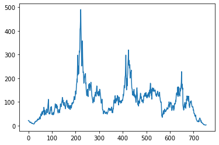
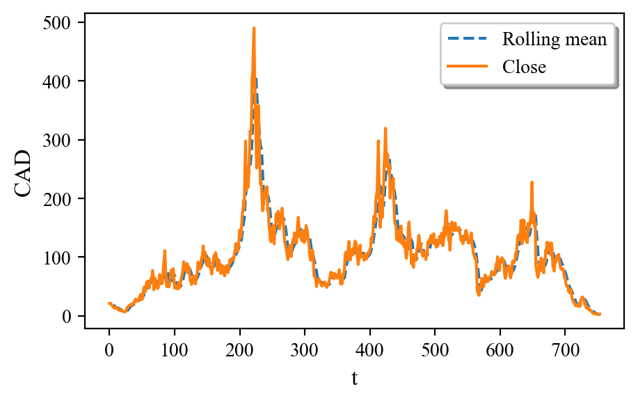
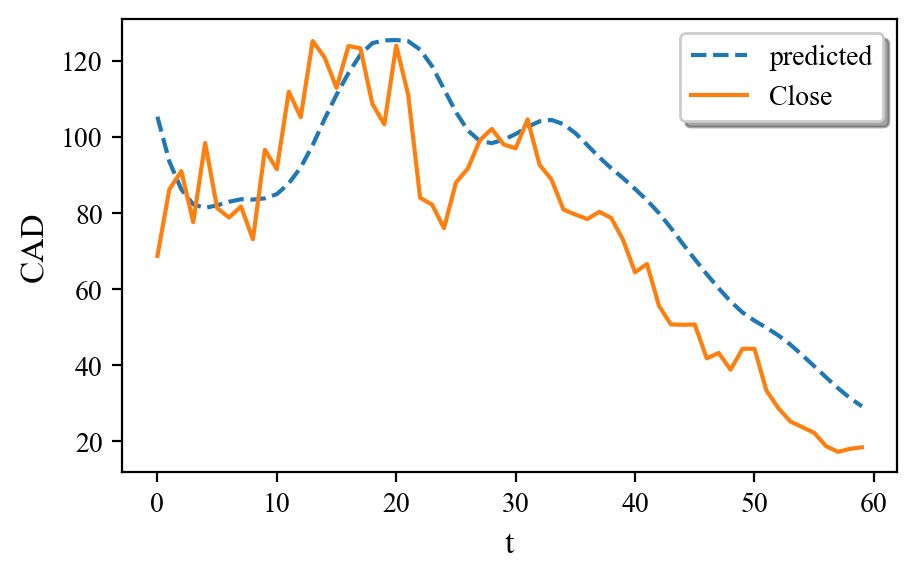

```python
import os
import pandas as pd
import numpy as np
import matplotlib.pyplot as plt
import datetime
import plotly.express as px
from sklearn.preprocessing import MinMaxScaler
```


```python
os.listdir()
```


    ['.ipynb_checkpoints', 'HND.TO (1).csv', 'stock price prediction.ipynb']


```python
file = pd.read_csv('HND.TO (1).csv')
file.head()
```


<div>
<style scoped>
    .dataframe tbody tr th:only-of-type {
        vertical-align: middle;
    }

    .dataframe tbody tr th {
        vertical-align: top;
    }

    .dataframe thead th {
        text-align: right;
    }
</style>
<table border="1" class="dataframe">
  <thead>
    <tr style="text-align: right;">
      <th></th>
      <th>Date</th>
      <th>Open</th>
      <th>High</th>
      <th>Low</th>
      <th>Close</th>
      <th>Adj Close</th>
      <th>Volume</th>
    </tr>
  </thead>
  <tbody>
    <tr>
      <th>0</th>
      <td>2008-01-14</td>
      <td>20.230000</td>
      <td>21.040001</td>
      <td>20.100000</td>
      <td>20.850000</td>
      <td>20.850000</td>
      <td>7800</td>
    </tr>
    <tr>
      <th>1</th>
      <td>2008-01-21</td>
      <td>22.000000</td>
      <td>22.940001</td>
      <td>21.040001</td>
      <td>21.040001</td>
      <td>21.040001</td>
      <td>24300</td>
    </tr>
    <tr>
      <th>2</th>
      <td>2008-01-28</td>
      <td>21.040001</td>
      <td>21.299999</td>
      <td>20.160000</td>
      <td>21.299999</td>
      <td>21.299999</td>
      <td>1700</td>
    </tr>
    <tr>
      <th>3</th>
      <td>2008-02-04</td>
      <td>21.080000</td>
      <td>21.250000</td>
      <td>18.900000</td>
      <td>19.270000</td>
      <td>19.270000</td>
      <td>7000</td>
    </tr>
    <tr>
      <th>4</th>
      <td>2008-02-11</td>
      <td>18.120001</td>
      <td>18.570000</td>
      <td>16.799999</td>
      <td>17.459999</td>
      <td>17.459999</td>
      <td>59300</td>
    </tr>
  </tbody>
</table>
</div>


```python
file.info()
```

    <class 'pandas.core.frame.DataFrame'>
    RangeIndex: 754 entries, 0 to 753
    Data columns (total 7 columns):
     #   Column     Non-Null Count  Dtype  
    ---  ------     --------------  -----  
     0   Date       754 non-null    object 
     1   Open       754 non-null    float64
     2   High       754 non-null    float64
     3   Low        754 non-null    float64
     4   Close      754 non-null    float64
     5   Adj Close  754 non-null    float64
     6   Volume     754 non-null    int64  
    dtypes: float64(5), int64(1), object(1)
    memory usage: 41.4+ KB
    


```python
plt.plot(file['Close'])
```


    [<matplotlib.lines.Line2D at 0x22a0ee78400>]


    

    


```python
file['rollingmean'] = file['Close'].rolling(7).mean()
file.head(10)
```


<div>
<style scoped>
    .dataframe tbody tr th:only-of-type {
        vertical-align: middle;
    }

    .dataframe tbody tr th {
        vertical-align: top;
    }

    .dataframe thead th {
        text-align: right;
    }
</style>
<table border="1" class="dataframe">
  <thead>
    <tr style="text-align: right;">
      <th></th>
      <th>Date</th>
      <th>Open</th>
      <th>High</th>
      <th>Low</th>
      <th>Close</th>
      <th>Adj Close</th>
      <th>Volume</th>
      <th>rollingmean</th>
    </tr>
  </thead>
  <tbody>
    <tr>
      <th>0</th>
      <td>2008-01-14</td>
      <td>20.230000</td>
      <td>21.040001</td>
      <td>20.100000</td>
      <td>20.850000</td>
      <td>20.850000</td>
      <td>7800</td>
      <td>NaN</td>
    </tr>
    <tr>
      <th>1</th>
      <td>2008-01-21</td>
      <td>22.000000</td>
      <td>22.940001</td>
      <td>21.040001</td>
      <td>21.040001</td>
      <td>21.040001</td>
      <td>24300</td>
      <td>NaN</td>
    </tr>
    <tr>
      <th>2</th>
      <td>2008-01-28</td>
      <td>21.040001</td>
      <td>21.299999</td>
      <td>20.160000</td>
      <td>21.299999</td>
      <td>21.299999</td>
      <td>1700</td>
      <td>NaN</td>
    </tr>
    <tr>
      <th>3</th>
      <td>2008-02-04</td>
      <td>21.080000</td>
      <td>21.250000</td>
      <td>18.900000</td>
      <td>19.270000</td>
      <td>19.270000</td>
      <td>7000</td>
      <td>NaN</td>
    </tr>
    <tr>
      <th>4</th>
      <td>2008-02-11</td>
      <td>18.120001</td>
      <td>18.570000</td>
      <td>16.799999</td>
      <td>17.459999</td>
      <td>17.459999</td>
      <td>59300</td>
      <td>NaN</td>
    </tr>
    <tr>
      <th>5</th>
      <td>2008-02-18</td>
      <td>16.309999</td>
      <td>16.700001</td>
      <td>15.160000</td>
      <td>15.170000</td>
      <td>15.170000</td>
      <td>102800</td>
      <td>NaN</td>
    </tr>
    <tr>
      <th>6</th>
      <td>2008-02-25</td>
      <td>15.000000</td>
      <td>15.850000</td>
      <td>14.250000</td>
      <td>14.550000</td>
      <td>14.550000</td>
      <td>219000</td>
      <td>18.520000</td>
    </tr>
    <tr>
      <th>7</th>
      <td>2008-03-03</td>
      <td>14.500000</td>
      <td>14.870000</td>
      <td>12.720000</td>
      <td>13.310000</td>
      <td>13.310000</td>
      <td>238200</td>
      <td>17.442857</td>
    </tr>
    <tr>
      <th>8</th>
      <td>2008-03-10</td>
      <td>13.530000</td>
      <td>13.700000</td>
      <td>11.990000</td>
      <td>13.010000</td>
      <td>13.010000</td>
      <td>191300</td>
      <td>16.295714</td>
    </tr>
    <tr>
      <th>9</th>
      <td>2008-03-17</td>
      <td>13.510000</td>
      <td>16.059999</td>
      <td>13.110000</td>
      <td>15.000000</td>
      <td>15.000000</td>
      <td>244700</td>
      <td>15.395714</td>
    </tr>
  </tbody>
</table>
</div>


```python
plt.figure(figsize=(5,3), dpi=200)
#plt.figure(figsize=(25,20))
#plt.title('Some plots', fontdict={'fontname':'Times New Roman', 'fontsize': 16})

#plt.plot(x1, y1, 'yo', label = 'Cr')
#plt.plot(x1, y2, 'rs', label = 'Mn')
#plt.plot(x1, y3, 'bD', label = 'Mo')
#plt.plot(x2, y4, 'c^', label = 'Nb')
#plt.plot(x2, y5, 'ks', fillstyle='none', label = 'Ti')

plt.plot(file['rollingmean'], '--', label = 'Rolling mean')
plt.plot(file['Close'], label = 'Close')


# colors - b g r c m y k w
# markers - filled_markers = ('o', 'v', '^', '<', '>', '8', 's', 'p', '*', 'h', 'H', 'D', 'd', 'P', 'X')
# markers - fillstyles = ('full', 'left', 'right', 'bottom', 'top', 'none')
plt.xlabel('t', fontdict={'fontname':'Times New Roman', 'fontsize': 12})
plt.ylabel('CAD', fontdict={'fontname':'Times New Roman', 'fontsize': 12})

#plt.xticks([0,2,4,6,8,10,12,14])
#plt.yticks([0,5,10,15])
plt.xticks(fontsize= 10, fontname = 'Times New Roman')
plt.yticks(fontsize= 10, fontname = 'Times New Roman')
#secax = plt.secondary_xaxis('right', y1)

#plt.axes().yaxis.set_tick_params(which='minor', right = 'off')

plt.legend(loc='best', shadow = True, fontsize= 10, prop={'family': 'Times New Roman'})
# loc = best, upper right,
plt.show()
```


    

    


```python
X = pd.DataFrame(file['Close'])
X
```


<div>
<style scoped>
    .dataframe tbody tr th:only-of-type {
        vertical-align: middle;
    }

    .dataframe tbody tr th {
        vertical-align: top;
    }

    .dataframe thead th {
        text-align: right;
    }
</style>
<table border="1" class="dataframe">
  <thead>
    <tr style="text-align: right;">
      <th></th>
      <th>Close</th>
    </tr>
  </thead>
  <tbody>
    <tr>
      <th>0</th>
      <td>20.850000</td>
    </tr>
    <tr>
      <th>1</th>
      <td>21.040001</td>
    </tr>
    <tr>
      <th>2</th>
      <td>21.299999</td>
    </tr>
    <tr>
      <th>3</th>
      <td>19.270000</td>
    </tr>
    <tr>
      <th>4</th>
      <td>17.459999</td>
    </tr>
    <tr>
      <th>...</th>
      <td>...</td>
    </tr>
    <tr>
      <th>749</th>
      <td>2.310000</td>
    </tr>
    <tr>
      <th>750</th>
      <td>2.340000</td>
    </tr>
    <tr>
      <th>751</th>
      <td>2.120000</td>
    </tr>
    <tr>
      <th>752</th>
      <td>3.060000</td>
    </tr>
    <tr>
      <th>753</th>
      <td>3.060000</td>
    </tr>
  </tbody>
</table>
<p>754 rows × 1 columns</p>
</div>


```python
sc = MinMaxScaler(feature_range=(0, 1))
X_scaled = sc.fit_transform(X)
```


```python
X_train = []
y_train = []
for i in range(60, 600):
    X_train.append(X_scaled[i-60:i, 0])
    y_train.append(X_scaled[i, 0])

X_train, y_train = np.array(X_train), np.array(y_train)
X_train = np.reshape(X_train, (X_train.shape[0], X_train.shape[1], 1))
```


```python
from keras.models import Sequential
from keras.layers import Dense
from keras.layers import LSTM
from keras.layers import Dropout
```


```python
regressor = Sequential()
```


```python
regressor.add(LSTM(units = 25, return_sequences = True, 
                   input_shape = (X_train.shape[1], 1)))
regressor.add(Dropout(0.2))

regressor.add(LSTM(units = 25, return_sequences = True))
regressor.add(Dropout(0.2))

regressor.add(LSTM(units = 25, return_sequences = True))
regressor.add(Dropout(0.2))

regressor.add(LSTM(units = 25))
regressor.add(Dropout(0.2))

regressor.add(Dense(units = 1))
```


```python
regressor.compile(optimizer = 'adam', loss = 'mean_squared_error')

regressor.fit(X_train, y_train, epochs = 50, batch_size = 16)
```

    Epoch 1/50
    34/34 [==============================] - 13s 52ms/step - loss: 0.0199
    Epoch 2/50
    34/34 [==============================] - 2s 52ms/step - loss: 0.0112
    Epoch 3/50
    34/34 [==============================] - 2s 52ms/step - loss: 0.0090
    Epoch 4/50
    34/34 [==============================] - 2s 51ms/step - loss: 0.0068
    Epoch 5/50
    34/34 [==============================] - 2s 52ms/step - loss: 0.0069
    Epoch 6/50
    34/34 [==============================] - 2s 52ms/step - loss: 0.0073
    Epoch 7/50
    34/34 [==============================] - 2s 52ms/step - loss: 0.0073
    Epoch 8/50
    34/34 [==============================] - 2s 59ms/step - loss: 0.0068
    Epoch 9/50
    34/34 [==============================] - 2s 62ms/step - loss: 0.0058
    Epoch 10/50
    34/34 [==============================] - 2s 57ms/step - loss: 0.0051
    Epoch 11/50
    34/34 [==============================] - 2s 57ms/step - loss: 0.0058
    Epoch 12/50
    34/34 [==============================] - 2s 58ms/step - loss: 0.0058
    Epoch 13/50
    34/34 [==============================] - 2s 58ms/step - loss: 0.0051
    Epoch 14/50
    34/34 [==============================] - 2s 57ms/step - loss: 0.0057
    Epoch 15/50
    34/34 [==============================] - 2s 58ms/step - loss: 0.0052
    Epoch 16/50
    34/34 [==============================] - 2s 57ms/step - loss: 0.0053
    Epoch 17/50
    34/34 [==============================] - 2s 59ms/step - loss: 0.0056
    Epoch 18/50
    34/34 [==============================] - 2s 57ms/step - loss: 0.0052
    Epoch 19/50
    34/34 [==============================] - 2s 58ms/step - loss: 0.0045
    Epoch 20/50
    34/34 [==============================] - 2s 59ms/step - loss: 0.0052
    Epoch 21/50
    34/34 [==============================] - 2s 58ms/step - loss: 0.0050
    Epoch 22/50
    34/34 [==============================] - 2s 58ms/step - loss: 0.0047
    Epoch 23/50
    34/34 [==============================] - 2s 60ms/step - loss: 0.0053
    Epoch 24/50
    34/34 [==============================] - 2s 59ms/step - loss: 0.0047
    Epoch 25/50
    34/34 [==============================] - 2s 60ms/step - loss: 0.0047
    Epoch 26/50
    34/34 [==============================] - 2s 59ms/step - loss: 0.0053
    Epoch 27/50
    34/34 [==============================] - 2s 57ms/step - loss: 0.0047
    Epoch 28/50
    34/34 [==============================] - 2s 58ms/step - loss: 0.0044
    Epoch 29/50
    34/34 [==============================] - 2s 57ms/step - loss: 0.0040
    Epoch 30/50
    34/34 [==============================] - 2s 57ms/step - loss: 0.0053
    Epoch 31/50
    34/34 [==============================] - 2s 56ms/step - loss: 0.0049
    Epoch 32/50
    34/34 [==============================] - 2s 58ms/step - loss: 0.0040
    Epoch 33/50
    34/34 [==============================] - 2s 59ms/step - loss: 0.0041
    Epoch 34/50
    34/34 [==============================] - 2s 58ms/step - loss: 0.0042
    Epoch 35/50
    34/34 [==============================] - 2s 57ms/step - loss: 0.0042
    Epoch 36/50
    34/34 [==============================] - 2s 58ms/step - loss: 0.0045
    Epoch 37/50
    34/34 [==============================] - 2s 57ms/step - loss: 0.0040
    Epoch 38/50
    34/34 [==============================] - 2s 58ms/step - loss: 0.0039
    Epoch 39/50
    34/34 [==============================] - 2s 59ms/step - loss: 0.0044
    Epoch 40/50
    34/34 [==============================] - 2s 58ms/step - loss: 0.0040
    Epoch 41/50
    34/34 [==============================] - 2s 59ms/step - loss: 0.0039
    Epoch 42/50
    34/34 [==============================] - 2s 55ms/step - loss: 0.0042
    Epoch 43/50
    34/34 [==============================] - 2s 55ms/step - loss: 0.0040
    Epoch 44/50
    34/34 [==============================] - 2s 58ms/step - loss: 0.0043
    Epoch 45/50
    34/34 [==============================] - 2s 58ms/step - loss: 0.0037
    Epoch 46/50
    34/34 [==============================] - 2s 58ms/step - loss: 0.0046
    Epoch 47/50
    34/34 [==============================] - 2s 57ms/step - loss: 0.0035
    Epoch 48/50
    34/34 [==============================] - 2s 57ms/step - loss: 0.0042
    Epoch 49/50
    34/34 [==============================] - 2s 58ms/step - loss: 0.0036
    Epoch 50/50
    34/34 [==============================] - 2s 59ms/step - loss: 0.0032
    


    <keras.callbacks.History at 0x22a011c0160>


```python
X_test = []
for i in range(660, 720):
    X_test.append(X_scaled[i-60:i, 0])
X_test = np.array(X_test)
X_test = np.reshape(X_test, (X_test.shape[0], X_test.shape[1], 1))
predicted_stock_price = regressor.predict(X_test)
psp = sc.inverse_transform(predicted_stock_price)
```

    2/2 [==============================] - 6s 13ms/step
    


```python
temp = np.array(file['Close'][659:719])
temp
```


    array([ 68.699997,  86.199997,  91.      ,  77.599998,  98.400002,
            81.300003,  78.800003,  81.699997,  73.099998,  96.599998,
            91.5     , 111.900002, 105.199997, 125.199997, 120.900002,
           112.900002, 123.900002, 123.300003, 108.699997, 103.300003,
           124.      , 111.099998,  84.      ,  82.199997,  76.      ,
            88.      ,  91.699997,  99.099998, 102.099998,  98.      ,
            97.      , 104.599998,  92.699997,  88.800003,  80.900002,
            79.599998,  78.400002,  80.300003,  78.699997,  72.900002,
            64.400002,  66.599998,  55.599998,  50.700001,  50.599998,
            50.700001,  41.799999,  43.200001,  38.799999,  44.299999,
            44.299999,  33.299999,  28.700001,  25.200001,  23.700001,
            22.200001,  18.700001,  17.200001,  18.      ,  18.4     ])


```python
plt.figure(figsize=(5,3), dpi=200)
#plt.figure(figsize=(25,20))
#plt.title('Some plots', fontdict={'fontname':'Times New Roman', 'fontsize': 16})

plt.plot(psp, '--', label = 'predicted')
plt.plot(temp, label = 'Close')

plt.xlabel('t', fontdict={'fontname':'Times New Roman', 'fontsize': 12})
plt.ylabel('CAD', fontdict={'fontname':'Times New Roman', 'fontsize': 12})

#plt.xticks([0,2,4,6,8,10,12,14])
#plt.yticks([0,5,10,15])
plt.xticks(fontsize= 10, fontname = 'Times New Roman')
plt.yticks(fontsize= 10, fontname = 'Times New Roman')
#secax = plt.secondary_xaxis('right', y1)

#plt.axes().yaxis.set_tick_params(which='minor', right = 'off')

plt.legend(loc='best', shadow = True, fontsize= 10, prop={'family': 'Times New Roman'})
# loc = best, upper right,
plt.show()
```


    

    


```python

```


```python

```


```python

```


```python

```


```python

```


```python

```


```python

```


```python

```
